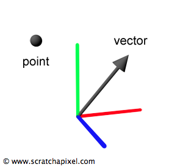

关键字：向量(vector)、点(point)、矩阵(matrix)、法线(normal)、变换(transformation)、笛卡尔坐标系(Cartesian coordinate system)、笛卡尔坐标(Cartesian coordinates)、球面坐标(spherical coordinates)、坐标系(coordinate system)
> 几何学是数学的一个基础分支，主要研究形状、大小、图形的相对位置等空间区域关系以及空间形式的度量。

## 提醒一句

这节课程对于大多数读者来说是又长又无聊的。但是如果你是刚接触 **计算机图形学(Computer Graphics)** 领域的，建议你就得花点时间认真阅读一下。充分了解关于计算机图形学 **管线(pipeline)** 这一部分是非常重要的，因为之后会省下你很多的时间。

## 几何学简介

点、向量、矩阵和法线对于计算机图形学来说就好比是字母表对于文学而言，因此大多数计算机图形学的书的第一章都是介绍 **线性代数(linear algebra)** 和 **几何学(geometry)** 。然而，对于很多为了学习图形编程的人来说，在学习怎么做出视觉效果之前一下子看到这么多的数学知识会非常烦躁的。如果你因为对数学不感冒或者不明白矩阵到底是什么，所以觉得计算机图形学不太适合自己，先别放弃。

我们首先开始几节不需要任何线性代数知识的 "**3D渲染基础(Foundation of 3D Rendering)**" 的课程。这是一种教计算机图形学编程技术的非主流做法，但是你从实际和有趣的东西开始学习会越来越兴奋的：比如， **光线追踪(ray tracer)** 的基础只需要一丁点的数学和一些编程知识就可以做出有趣的东西。写一个 **渲染器(renderer)** 是更令人兴奋和有益的学习数学的方法，正如你所看到的，你会一步步通过使用目前你学习的知识做出实际的结果(如你最后做出来的图像)。话虽然这么说，点、向量和矩阵是在做计算机图形学图像的过程中的必要的工具，我们几乎会在每一节课程广泛地使用到这些知识。

在这节课程，你会学习到计算机图形学相关的许多概念以及其用途还有各种使用到这些概念的技术。这节课会介绍计算机图形学研究学者是如何使用不同的线性代数的方法去解决问题、编写代码的。你会注意到这些方法是很少在书里提到的（同时也很少记录在网上）。这些方法很重要，在你可以阅读或者使用到其他开发者的代码或技术时仔细斟酌一下他们使用了哪种方法。

在我们正式开始之前先来个快速总结。如果你是一个纯数学研究者，你可能会觉得很奇怪，因为整个教程里没有用专业的线性代数相关知识来介绍东西。我们希望这门课程涉及的范围广同时只包含在计算机图形学里普遍使用到的简单的向量和矩阵知识。例如，一个点，从数学上来说是与线性代数(只关心向量的数学分支)没有什么关系的。我们选择介绍点因为点在计算机图形学是最普遍的(连线性代数的一些数学方法都可以用来操作点)。如果你不懂点和向量的区别，不用担心。我们会在这一章介绍它们的区别。

## 什么是线性代数?向量的介绍

线性代数到底是什么？我们会在这门课程学到什么？正如我们在上面提到的，线性代数是一个研究**向量(vectors)**的数学分支。那么你可能会问，“什么是向量？为什么向量在计算机图形学世界里这么有用？”。简单来说，一个向量可以表示成一组**数字(numbers)**。这一组数字可以设置为任意的长度，所以有时候也会被叫做数学里的**元组(tuple)**。如果我们想要具体的向量长度，可以用n-tuple来表示，n代表向量元素的个数。以下是6个元素的向量的数学符号表示例子
```
V=(a,b,c,d,e,f),
```
(a,b,c,d,e,f)都是实数。

将这些数据全部分组的目的是让这些数据在问题的上下文中有特定的有意义的值或者概念。例如，在计算机图形学里，向量可以用来表示空间中的位置和方向。我们也可以通过一个非常强大和简洁的方法进行一系列的操作变换(或改变)这些向量。这种改变向量内容的变换过程叫做线性变换(linear transformation)。我们后面会花更多的时间去讨论向量变换，现在我们只需要知道他们很重要就行了。

## 点和向量

术语点和向量在不同环境下被用于许多科学领域。这节课我们会解释涉及到这个教程和计算机图形学中点和向量的意义。

在这里，一个点是三维空间中的一个位置；一个向量通常是三维空间中的方向(和相应的幅度或者说大小)。向量可以被看作箭头指向各个方向。三维的点和向量可以用上面提到的多元组来表示。
```
V=(x,y,x),
```
(x,y,z)都是实数。



你会发现，当你和数学家或者物理学家讨论的时候，他们对于向量和点的理解会更综合；他们不会严格要求向量和点要像我们在计算机图形学里用的那样使用。对于他们，一个向量可以是任意的甚至有可能是无穷大的(表示向量可以容纳尽可能多的数据)。

我们用简短的齐次坐标(homogeneous coordinates)介绍结束这段(译者注：原文是homogenous points)。有的时候因为计算方便需要将坐标增加一个第四元。下面是齐次坐标的例子：
```
PH=(x,y,z,w)
```
齐次坐标来源于点的矩阵乘法。在这节课不用关心太多关于齐次坐标。因为齐次坐标有时候会出现在文献中，会给读者带来一些疑惑，所以在这里就提一下。齐次坐标之后会详细解释。

## 仿射变换的介绍


